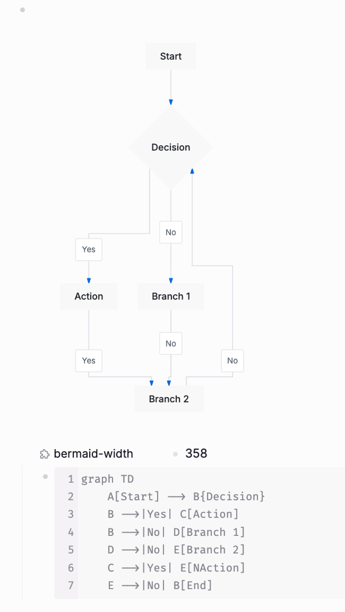
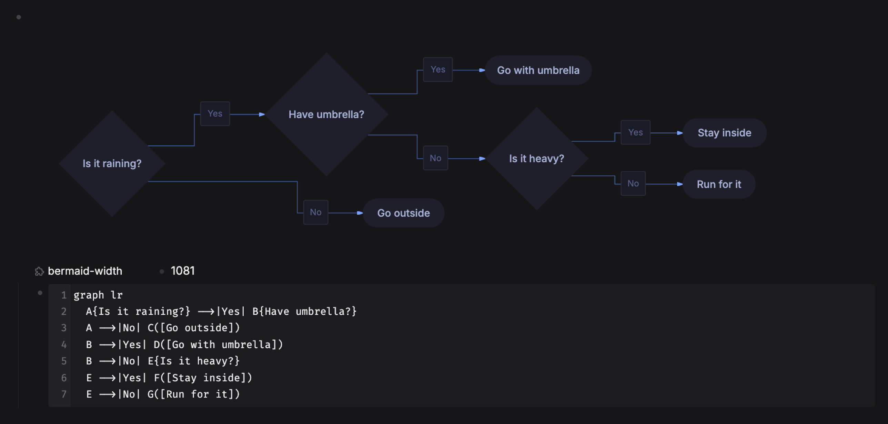
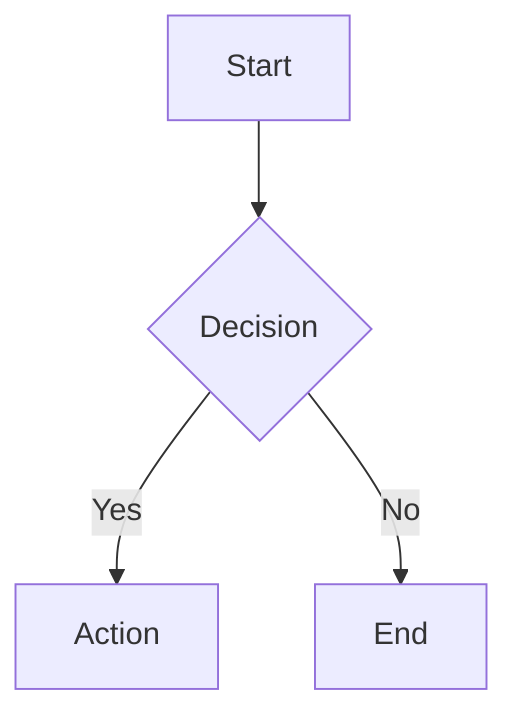

# Bermaid

Bermaid is a Logseq plugin that renders beautiful Mermaid diagrams with the [beautiful-mermaid](https://github.com/lukilabs/beautiful-mermaid) renderer ([npm](https://www.npmjs.com/package/beautiful-mermaid)).





## Features

- Render diagrams from `{{renderer :bermaid}}` using child block content
- `/bermaid` slash command to insert an empty diagram block, ready for your Mermaid syntax
- **Lightbox** — click any diagram to open a full-screen overlay with zoom and pan
- **Zoom & pan** — scroll to zoom (12.5 %–800 %), click-drag to pan, zoom controls pill at the bottom
- Copy rendered diagrams as PNG via hover button
- Drag to resize diagrams from left or right edge
- **Live re-render** — edit a diagram's source and the render updates in place, no reload
- Custom width persists in the macro itself (`{{renderer :bermaid, 500}}`), so it survives in both file-based and DB graphs
- Theme support with `auto` mode that follows Logseq light/dark mode
- Optional transparent background setting

## Install (from source)

1. Install dependencies:

   ```bash
   npm install
   ```

2. Build the plugin:

   ```bash
   npm run build
   ```

3. Load into Logseq:
   - **Desktop:** Plugins → **Load unpacked plugin** → select this project folder.
   - **Web (`http://localhost:3001`):** run `npm run serve` and follow the [Development](#development) instructions to load from `http://localhost:8080`.

## Usage

### Quick start with slash command

1. In a block, type `/bermaid` and run the command.
2. Bermaid inserts:
   - `{{renderer :bermaid}}` in the current block
   - A child block with starter Mermaid syntax
3. Edit the child block text and the diagram updates on render.

### Manual macro

Create a block:

```text
{{renderer :bermaid}}
```

Add Mermaid syntax in child blocks, for example:



## Interactions

- **Lightbox**: click the diagram to open full-screen; press Esc, click the backdrop, or click the ✕ button to close
- **Zoom**: scroll the mouse wheel inside the lightbox to zoom toward the cursor; use the `−` / `+` / `⊙` control pill at the bottom
- **Pan**: click-drag inside the lightbox to pan the diagram
- **Copy as PNG**: hover and click the copy button
- **Resize**: drag the left or right resize handle on diagram edges; the width is written back into the macro as `{{renderer :bermaid, NNN}}`
- **Edit**: change the Mermaid source in the child block and the diagram re-renders in place

## Settings

- **Theme**: `auto` or a specific beautiful-mermaid theme
- **Transparent Background**: controls SVG/PNG background transparency

## Development

Development requires two concurrent processes:

- **File watcher** — rebuilds `dist/` on every save:

  ```bash
  npm run watch
  ```

- **Dev HTTP server** — serves the plugin at `http://localhost:8080`:

  ```bash
  npm run serve
  ```

Then in Logseq (Developer mode enabled): Plugins → ⋮ → "Load plugin from web url" → `http://localhost:8080`.

- Production build:

  ```bash
  npm run build
  ```

## Publish on GitHub

This repository includes `.github/workflows/publish.yml`.

- Create and push a version tag (for example `v0.1.0`)
- GitHub Actions builds the plugin and creates `logseq-bermaid.zip`
- The workflow uploads the zip to the GitHub release for that tag

Example:

```bash
git tag v0.2.1
git push origin v0.2.1
```

## Publish to Logseq Marketplace

Detailed steps and a manifest template are in [docs/MARKETPLACE_SUBMISSION.md](docs/MARKETPLACE_SUBMISSION.md).

> Marketplace review requires at least one screenshot or animated GIF in the README showing the plugin in action.

## Credits

- [**beautiful-mermaid**](https://github.com/lukilabs/beautiful-mermaid) by [lukilabs](https://github.com/lukilabs) — the SVG rendering engine that does all the heavy lifting. Bermaid is a thin Logseq integration around it; the diagrams, themes, and styling come from beautiful-mermaid.
- [**Mermaid**](https://github.com/mermaid-js/mermaid) — the diagramming language beautiful-mermaid is built on.

## License

MIT
