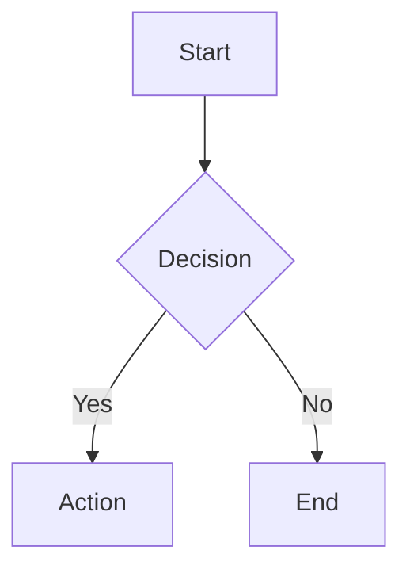

# Bermaid

Bermaid is a Logseq plugin that renders beautiful Mermaid diagrams with the [beautiful-mermaid](https://www.npmjs.com/package/beautiful-mermaid) renderer.

## Features

- Render diagrams from `{{renderer :bermaid}}` using child block content
- `/bermaid` slash command to insert a starter diagram
- Copy rendered diagrams as PNG (hover button or right-click menu)
- Drag to resize diagrams from left or right edge
- Persist custom width per block in DB graphs
- Theme support with `auto` mode that follows Logseq light/dark mode
- Optional transparent background setting

## Install (from source)

1. Install dependencies:

   ```bash
   npm install
   ```

2. Build the plugin:

   ```bash
   npm run build
   ```

3. In Logseq, go to **Plugins → Load unpacked plugin**.
4. Select this project folder.

## Usage

### Quick start with slash command

1. In a block, type `/bermaid` and run the command.
2. Bermaid inserts:
   - `{{renderer :bermaid}}` in the current block
   - A child block with starter Mermaid syntax
3. Edit the child block text and the diagram updates on render.

### Manual macro

Create a block:

```text
{{renderer :bermaid}}
```

Add Mermaid syntax in child blocks, for example:



## Interactions

- **Copy as PNG**: hover and click the copy button, or right-click the diagram and choose copy
- **Resize**: drag the left or right resize handle on diagram edges

## Settings

- **Theme**: `auto` or a specific beautiful-mermaid theme
- **Transparent Background**: controls SVG/PNG background transparency

## Development

- Watch mode build:

  ```bash
  npm run dev
  ```

- Production build:

  ```bash
  npm run build
  ```

## Publish on GitHub

This repository includes `.github/workflows/publish.yml`.

- Create and push a version tag (for example `v0.1.0`)
- GitHub Actions builds the plugin and creates `logseq-bermaid.zip`
- The workflow uploads the zip to the GitHub release for that tag

Example:

```bash
git tag v0.1.0
git push origin v0.1.0
```

## Publish to Logseq Marketplace

1. Ensure the latest GitHub release has the plugin zip attached.
2. Fork `logseq/marketplace`.
3. Add `packages/logseq-bermaid/manifest.json` in your fork.
4. Open a PR to `logseq/marketplace`.

Detailed steps and a manifest template are in `MARKETPLACE_SUBMISSION.md`.

> Marketplace review expects at least one image or gif in README showing the plugin in action.

## License

MIT
